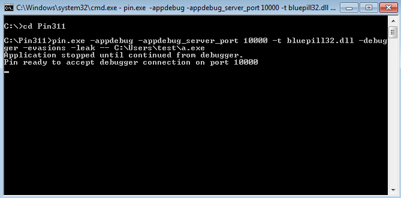
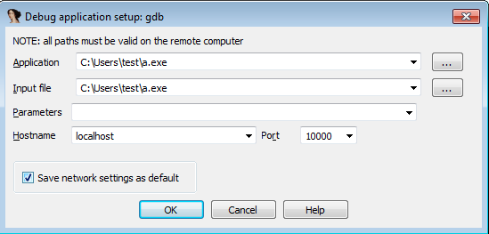
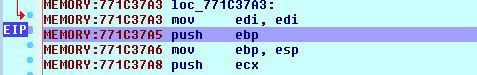

# BluePill

**Update (Mar 21, 2020):** *The official BlackHat video recordings are online! Check the link below and read the TIFS paper :-)*

**BluePill** is an open-source dynamic analysis framework for handling evasive malware. Its goal is to reconcile the transparency properties needed for automatic analyses with the fine-grained execution inspection and altering capabilities required for manual analysis. BluePill is an academic prototype under active development: your feedback is precious!

BluePill can counter many red pills targeting hypervisors, debuggers, third-party analysis tools (e.g. IDA Pro), and timing artifacts. It builds on dynamic binary instrumentation (DBI) to monitor adversarial queries that a sample can make on the environment looking for artifacts, and fix them when their results would give away the presence of an automated analysis or a human agent.

BluePill offers a GDB remote interface to analysts to debug a sample, complemented by a stealth patching mechanisms to hide code changes made in the debugger from self-checksumming schemes.

We tested BluePill on heterogeneous PE32 malware running on 32-bit Windows 7 SP1: as an example, we can run executables protected with recent versions of VMProtect and Themida, and highly evasive samples like Furtim.

To counter DBI evasions, BluePill uses a [library of mitigations](https://github.com/season-lab/sok-dbi-security/) that we wrote for Intel Pin as part of our paper *SoK: Using Dynamic Binary Instrumentation for Security (And How You May Get Caught Red-Handed)* from ASIACCS 2019. We extended the library with further mitigations for time overheads and red pills targeting the GDB remote debugging interface and exception handling.

BluePill has been presented in:
* ***Black Hat Europe 2019***. *BluePill: Neutralizing Anti-Analysis Behavior in Malware Dissection*. [[link]](https://www.blackhat.com/eu-19/briefings/schedule/index.html#bluepill-neutralizing-anti-analysis-behavior-in-malware-dissection-17685) [[slides]](https://i.blackhat.com/eu-19/Wednesday/eu-19-Delia-BluePill-Neutralizing-Anti-Analysis-Behavior-In-Malware-Dissection.pdf) [[video]](https://www.youtube.com/watch?v=F_AK5eDGeak)
* ***IEEE Transactions on Information Forensics and Security 2020***. *On the Dissection of Evasive Malware*. [[link]](https://ieeexplore.ieee.org/document/9018111) [[preprint]](https://www.diag.uniroma1.it/~delia/papers/tifs20.pdf)

*Before going public for BH Europe 2019, we made radical changes that broke the handling of 64-bit code and partially of the WoW64 subsystem: please consider these scenarios experimental as we complete the regression testing.*

### Compilation

BluePill builds on [Intel Pin](https://software.intel.com/en-us/articles/pin-a-dynamic-binary-instrumentation-tool) (v3.11 recommended) and requires Visual Studio 2015 or higher for its compilation.

Pin has some dependencies that require manual inclusion in the project. We created a `Locals.props` file that simplifies the project configuration. Its defaults are Pin being installed in `C:\Pin311` and the SDK 8.1 headers being in use: 

```
  <PropertyGroup Label="UserMacros">
    <PinFolder>C:\Pin311</PinFolder>
    <WinHPath>C:/Program Files (x86)/Windows Kits/8.1/Include/um</WinHPath>
  </PropertyGroup>
```

For instance, if you wish to use the SDK 10.0.17763.0 headers, after modifying the Project settings in Visual Studio
you should also change the value of the `WinHPath` property to `C:/Program Files/Windows Kits/10/Include/10.0.17763.0/um`. Similary, modify the property value if your SDK 8.1 headers are installed in `C:/Program Files/` instead of `C:/Program Files (x86)/`. The purpose of this field is to assist Pin when it includes the absolute path of `Windows.h` from its CRT headers.

You should now be able to compile BluePill. Once compilation ends, you will find a `bluepill32.dll` library in the Pin directory. If you encounter a missing `msvc_compat.h` error, make sure that `$(PinFolder)\extras\crt\include` is a valid path.


### Quick start

To run an executable under BluePill use:

```
C:\Pin311\pin.exe -t bluepill32.dll [options] -- <file.exe>
```

BluePill supports the following command-line options:

Option | Meaning
--- | --- 
`-evasions` | Detect and handle the majority of evasions supported (see below for DBI)
`-debugger` | Enable debugger mode via GDB remote interface
`-leak` | DBI evasions: fix leaks of real EIP (e.g. FPU instructions)
`-nx` | DBI evasions: check that code pages are executable
`-rw` | DBI evasions: hide pages that belong to the DBI engine

For instance, to run an evasive program named `sample.exe` in a sandbox-like automatic mode try:

```
C:\Pin311\pin.exe -t bluepill32.dll -evasions -leak  -- sample.exe
```

Enabling the `-leak` mitigation has minimal performance impact, while `-nx` and ultimately `-rw` can help with complex packers that attempt conformance checking on the address space of the program.

BluePill will create a file named `evasions.log` under Pin's folder `C:\Pin311` (modify the `LOGPATH` variable inside `pintool\src\logging.h` to change it) that logs possible evasion attempts intercepted during the execution.  

### Debugging via GDB remote interface

BluePill supports the use of a debugger to control the execution and carry out malware dissection. We rely on the GDB remote interface of Pin: BluePill can thus be used as a remote backend from your debugger tool if it supports the GDB protocol. In the following we provide instructions to set up a debugging session with IDA Pro.

To enable the debugger interface, you need to provide additional command-line options to both Pin (`-appdebug -appdebug_server_port <port>`) and BluePill (`-debugger`) as follows:

```
C:\Pin311\pin.exe -appdebug —appdebug_server_port 10000 -t bluepill32.dll -debugger [other options] -- <file.exe>
```

We will use `10000` as port number in this guide. The application will stay paused until you connect a debugger to the socket: however, if you try *attaching* a local debugger to the process, you will end up debugging the whole Pin engine instead of just the application. The expected output on screen will be something like:



#### Setting up IDA Pro
You can now open the executable in IDA and select the *Remote GDB debugger* backend from `Debugger->Switch debugger`. Check that the options (e.g. port number) are correct using `Debugger->Process options` like in the screenshot below:



At this point it helps to insert a breakpoint on some address in the main executable section, for instance on the entrypoint. Then you can start your debugging session with `Debugger->Start process`. IDA will notify you that *"There is already a process being debugged by remote. Do you want to attach to it?"*. Just click *Yes* and the debugging session will start, with EIP being somewhere inside in ntdll.dll.

Since memory mapping information is not available by default over the GDB remote protocol, we added a custom debugger command `vmmap` that instructs BluePill to build such a map. We automated this process with a script `addSegments.py` available in the `scripts/` folder: just load it in IDA with `File->Script file`. The script will populate the *Segments* subview of IDA with the memory layout information (i.e. sections and their permissions) for each code module. *Note: we will soon add code to update the Module subview, which currently stays stale.*

You can now debug your sample as BluePill shields you from a whole lot of evasions :-)

Please note that exception handling requires a workaround for the current GDB server implementation. When you need to pass an exception to the application just send a `wait` command right after you receive the exception message, then disconnect and reconnect IDA to BluePill, which meanwhile will put the execution on hold in response to the command.

#### Making stealth code edits
BluePill implements a unique functionality to patch a code portion when debugging while hiding it from the executing code. An applied patch remains invisible to anti-tampering schemes (e.g. self-checksumming sequences) as it is tighly coupled with the JIT mechanism of Pin. In a nutshell, we redo the JIT compilation to add trampolines that override the compiled (original) instructions and go unnoticed by code protection mechanisms, as memory reads keep being redirected to the original program instructions.

The creation of a patch is divded into three steps:
1. identifying the code portion you want to overwrite (start and end addresses);
2. assembling a piece of code to execute instead of the one identified at the previous step;
3. selecting the continuation address where to transfer execution once the patch has executed.

Consider the code block in the image below, and suppose we want to overwrite the `mov ebp, esp` instruction at address `0x771X37A5` with a `mov eax, esp` instruction (`89 e0` in binary), and then make execution resume at address `0x771X37A8`.



When BluePill is operating in debugger mode, we can instruct Pin for patches through a custom GDB command: `set_<START_ADDR>_<END_ADDR>_<CONT_ADDR>_<PATCH_CODE_BYTES>`, with addresses expressed as hex numbers and code patch bytes separated by a comma. For the example above we can use: `set_771c37a6_771c37a6_771c37a8_89,e0`.

Patches can then simply be removed using another custom GDB command: `rm_<START_ADDR>_<END_ADDR>`.


### Authors
* Daniele Cono D'Elia ([@dcdelia](https://github.com/dcdelia)) - design
* Federico Palmaro ([@nik94](https://github.com/nik94)) - main developer
